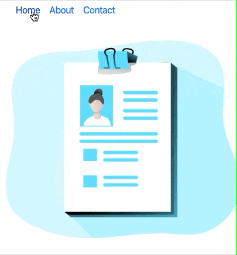

# Next JS Page Transitions 📱

## 👩🏻‍💻👨🏻‍💻 Development

Please sure that you have below environments

- Node JS >= 10.15.3
- NPM >= 6.13.0
- Yarn >= 1.16.0 (Recommended)

## ⚙️ Setup

Install node packages;

`yarn install`

Then run

`yarn dev`

for development

#### ⭐️ Show Your Support

Please give a ⭐️ if this project helped you!

#### 👏 Contributing

If you have any questions or requests or want to contribute to `rn-swipeable-panel`, please write the [issue](https://github.com/enesozturk/nextjs-page-transitions/issues) or give me a Pull Request freely.
